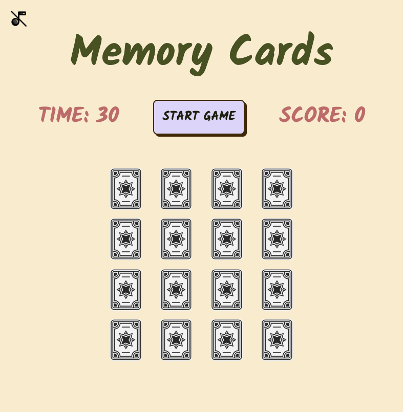
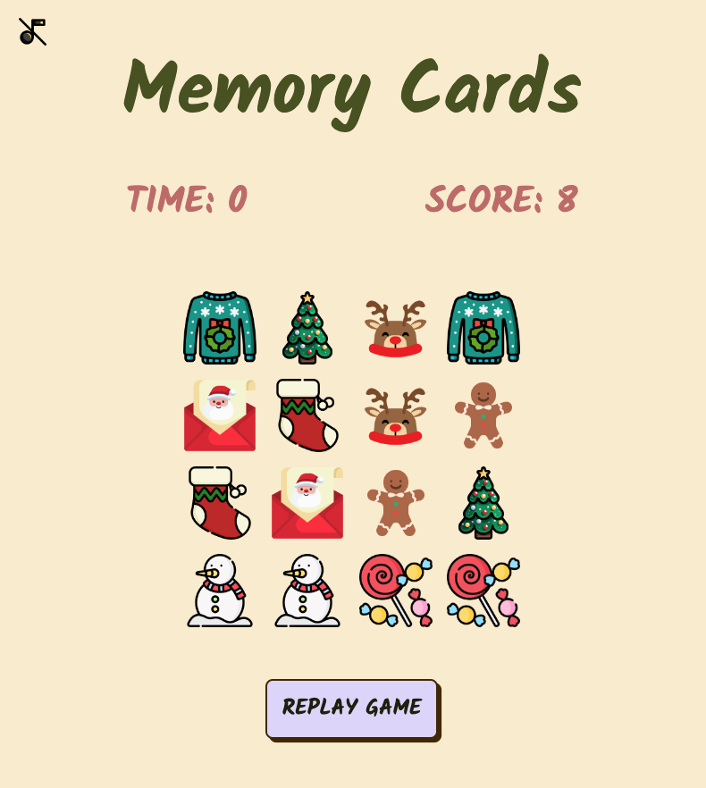

# Memory Game

This is a simple memory card game built with HTML, CSS, and JavaScript. The game challenges your memory skills by requiring you to match pairs of cards with the same images before time runs out. 

## Getting Started

[Click here to try the Memory Game](https://phuongmous.github.io/memory-game/)

To play the Memory Cards Game, simply click the "START GAME" button and the time will start counting down from 30 seconds. Your goal is to find and match all the pairs of cards with the same images before time runs out. After the game ends, you can click the "REPLAY GAME" button to restart the game if you want to try again.

## Instructions:

#### How to play
1. Click the "START GAME" button to begin.
2. Click on the cards to flip them over.
3. Your objective is to match pairs of cards with the same image.
4. When you find a matching pair, they will remain face-up and you will earn a point.
5. If the two cards have different images, they will flip back face down.
6. Continue matching pairs until you find all of them.
7. If you match all pairs before the timer runs out, you win the game and a "Congrats! You won" message will appear.

#### Game Rules
- You have 30 seconds to find and match all the pairs of cards.
+ You earn a point for each pair of cards you match.
- The game ends when you match all pairs or when the timer runs out.

#### Game Controls
- Click on cards to flip them and reveal their images.
+ Click the "START GAME" button to begin the game.
- Click the "REPLAY GAME" button to reset the game.
+ Click the music icon to stop the background music

## Technologies Used
- HTML
+ CSS
- JavaScript

## Next Steps
Planned future enhancements:
- Difficulty levels: Implement difficulty levels with different time limits and card flipping speed to cater to players of all skill levels.
+ High Scores: Add a high score system to track and display the best performances.
- Multiplayer Mode: Create a multiplayer version where players can compete with friends.

Have fun playing the Memory Cards Game and enjoy challenging your memory! Thank you!
